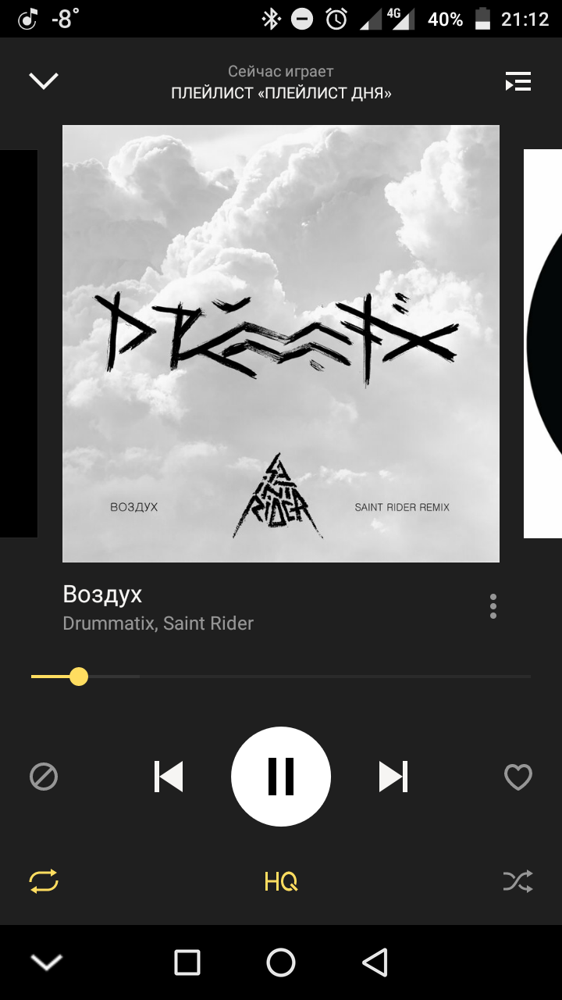

# Bluetooth Player Control

Bluetooth Player Control cli (for Polybar, i3status, etc...)

## Usage

### Polybar

> Phone player


> Polybar module


```ini

[module/bt_player_control]
type=custom/script
exec=python3 ~/Projects/bt_player_control/bt_player_control.py status --status-playing  --status-paused  --status-offline 
click-left=python3 ~/Projects/bt_player_control/bt_player_control.py play
click-right=python3 ~/Projects/bt_player_control/bt_player_control.py next
interval = 1
label = %output%
format-underline = #fff

```
